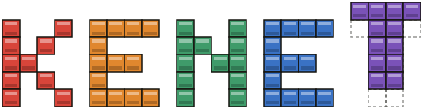
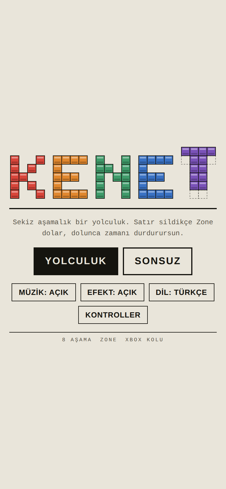
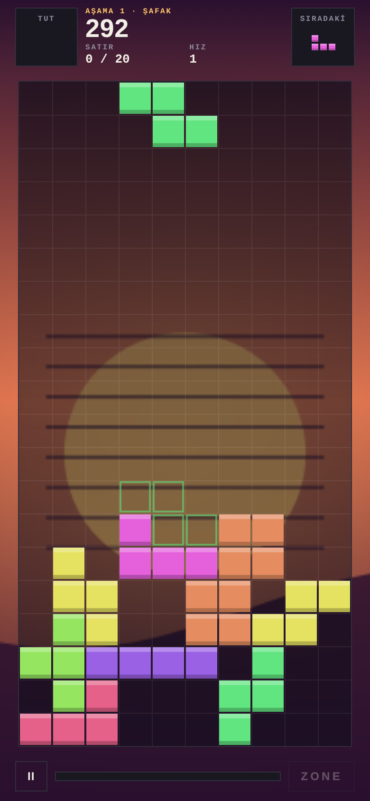
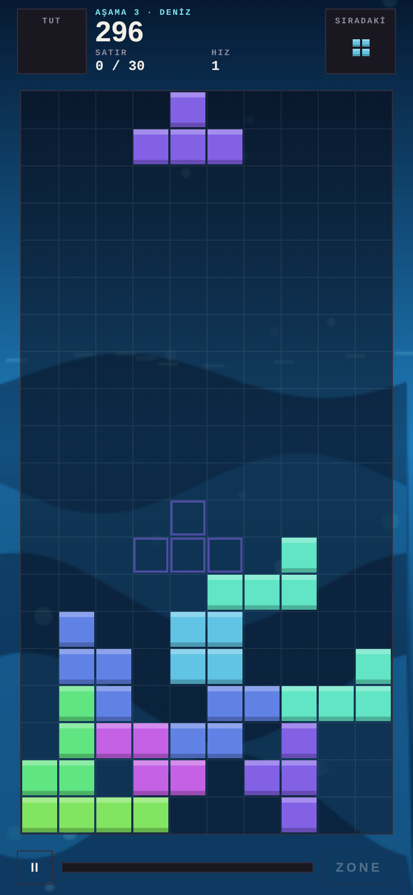
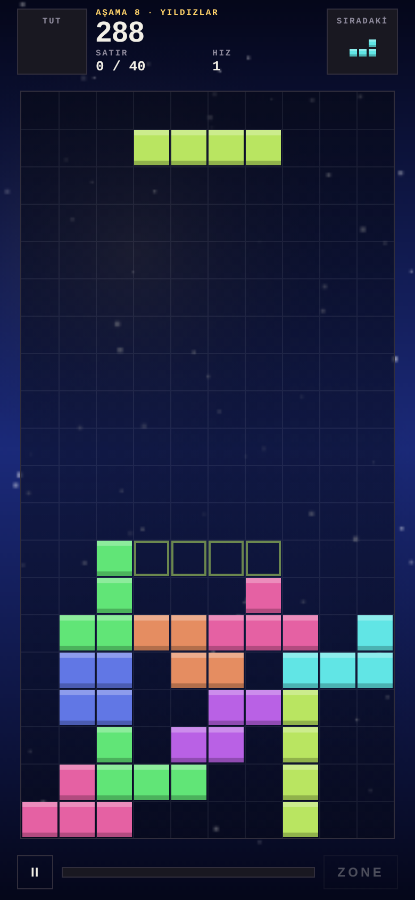

<p align="center">
  
</p>

<p align="center">
  <b>A calm, musical block puzzle for Android.</b><br>
  <i>Sakin, müzikli bir blok bulmaca oyunu.</i>
</p>

<p align="center">
  <a href="#english">English</a> · <a href="#türkçe">Türkçe</a>
</p>

<p align="center">
  
  
  
  
</p>

---

## English

**Kenet** is a block puzzle game built around a journey. You travel through eight stages, each with its own animated scene and its own music. The background pulses with the beat and reacts every time you clear a line.

### Features

- **8 stages, 8 worlds:** Dawn, Forest, Sea, Desert, Storm, City, Glacier, Stars. Each one has its own animated background.
- **Generated music:** every stage has its own soundtrack, created live while you play. No audio files needed.
- **Zone:** clearing lines fills the Zone meter. Use it to stop time and clear many lines at once.
- **Your own playlist:** add your songs when building the APK and the game plays them instead.
- **Journey and Endless modes.**
- **Gamepad support:** works with Xbox-style controllers.
- **Turkish and English**, switchable from the title screen.
- **Works offline.** No ads, no accounts, no tracking.

### Controls

| Action | Touch | Gamepad | Keyboard |
|---|---|---|---|
| Move | Swipe left / right | D-pad ← → | ← → |
| Rotate right | Tap right half | B / Y | X |
| Rotate left | Tap left half | A / X | Z |
| Soft drop | Drag down slowly | D-pad ↓ | ↓ |
| Hard drop | Flick down | D-pad ↑ | Space |
| Hold | Swipe up | LB / RB | C |
| Zone | ZONE button | LT / RT | E |
| Pause | ‖ button | ≡ | P |

### Install

1. Go to [Releases](../../releases) and download the latest `Kenet.apk` on your phone.
2. Open the file. If Android asks, allow installing apps from this source.
3. Play.

Requires Android 7.0 or newer.

### Build from source

**Windows:** double-click `build-apk.bat`. It finds (or downloads once) JDK 17 and the Android SDK, then creates `Kenet.apk` in the same folder.

**Any platform:** with JDK 17–21 and the Android SDK installed:

```bash
./gradlew assembleDebug
```

The whole game lives in a single file, `app/src/main/assets/index.html` (HTML5 Canvas + JavaScript). The Android part is a thin WebView shell. You can also open `index.html` in a browser to play or edit it.

### Your own music

Put your audio files (mp3, m4a, ogg, opus, wav, aac, flac) into the `muzik/` folder, then run `build-apk.bat`. In the game, choose **Music: my list**. Your songs are never uploaded to this repository.

### Credits

Designed and developed by **GNS**: concept, game design, stages, visual identity and sound direction. AI tools were used as a coding assistant.

### About this project

Kenet is a non-commercial hobby project, made for fun and shared for free. It is an independent work in the classic falling-block puzzle genre and is not affiliated with, endorsed by, or connected to any other game, company or trademark holder.

### License

[MIT](LICENSE)

---

## Türkçe

**Kenet**, bir yolculuk üzerine kurulu bir blok bulmaca oyunu. Her biri kendi hareketli sahnesine ve müziğine sahip sekiz aşamadan geçiyorsun. Arka plan ritimle nabız atıyor ve her satır sildiğinde tepki veriyor.

### Özellikler

- **8 aşama, 8 dünya:** Şafak, Orman, Deniz, Çöl, Fırtına, Şehir, Buzul, Yıldızlar. Her birinin kendine ait hareketli bir arka planı var.
- **Oyunun kendi müziği:** her aşamanın müziği sen oynarken anlık olarak üretiliyor. Ses dosyasına gerek yok.
- **Zone:** satır sildikçe Zone dolar. Zamanı durdurup birçok satırı tek seferde silmek için kullan.
- **Kendi listen:** APK'yı derlerken şarkılarını eklersen oyun onları çalar.
- **Yolculuk ve Sonsuz modları.**
- **Oyun kolu desteği:** Xbox tarzı kollarla çalışır.
- **Türkçe ve İngilizce**, başlık ekranından değiştirilebilir.
- **İnternetsiz çalışır.** Reklam yok, hesap yok, takip yok.

### Kontroller

| Hareket | Dokunmatik | Oyun kolu | Klavye |
|---|---|---|---|
| Taşı | Sola / sağa kaydır | Yön tuşları ← → | ← → |
| Sağa döndür | Sağ yarıya dokun | B / Y | X |
| Sola döndür | Sol yarıya dokun | A / X | Z |
| Yumuşak iniş | Yavaşça aşağı çek | Yön tuşu ↓ | ↓ |
| Hızlı iniş | Hızlıca aşağı kaydır | Yön tuşu ↑ | Boşluk |
| Tut | Yukarı kaydır | LB / RB | C |
| Zone | ZONE düğmesi | LT / RT | E |
| Duraklat | ‖ düğmesi | ≡ | P |

### Kurulum

1. [Releases](../../releases) sayfasından en son `Kenet.apk` dosyasını telefonuna indir.
2. Dosyayı aç. Android sorarsa bu kaynaktan uygulama yüklemeye izin ver.
3. Oyna.

Android 7.0 veya üstü gerekir.

### Kaynaktan derleme

**Windows:** `build-apk.bat` dosyasına çift tıkla. Gerekli JDK 17 ve Android SDK'yı bulur ya da bir kez indirir, aynı klasörde `Kenet.apk` oluşturur.

**Diğer sistemler:** JDK 17–21 ve Android SDK kuruluyken:

```bash
./gradlew assembleDebug
```

Oyunun tamamı tek bir dosyada: `app/src/main/assets/index.html` (HTML5 Canvas + JavaScript). Android tarafı ince bir WebView kabuğu. `index.html` dosyasını tarayıcıda açıp oynayabilir ya da düzenleyebilirsin.

### Kendi müziğin

Ses dosyalarını (mp3, m4a, ogg, opus, wav, aac, flac) `muzik/` klasörüne koy, sonra `build-apk.bat` dosyasını çalıştır. Oyunda **Müzik: listem** seç. Şarkıların bu depoya asla yüklenmez.

### Emeği geçenler

Tasarım ve geliştirme: **GNS**. Fikir, oyun tasarımı, aşamalar, görsel kimlik ve ses yönetimi. Kodlamada yapay zekâ araçlarından yardım alındı.

### Bu proje hakkında

Kenet kâr amacı gütmeyen bir hobi projesi. Eğlence için yapıldı ve ücretsiz paylaşılıyor. Klasik düşen blok bulmaca türünde bağımsız bir çalışmadır. Başka hiçbir oyun, şirket ya da marka sahibiyle bağlantılı değildir, onlar tarafından desteklenmemektedir.

### Lisans

[MIT](LICENSE)
